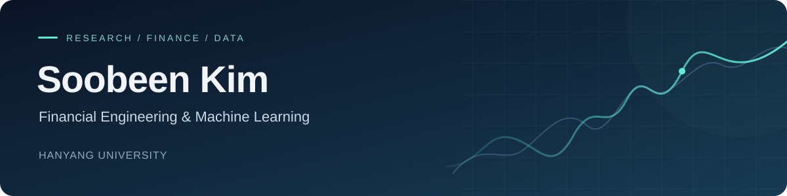

  

  <b>Integrated M.S.–Ph.D. Student · Industrial Engineering · Hanyang University</b> 
  Financial Engineering Lab · Master's stage, second semester

  
  
  
  

  <a href="#current-focus">Current Focus</a> &nbsp; / &nbsp;
  <a href="#competitions--achievements">Achievements</a> &nbsp; / &nbsp;
  <a href="#selected-research-projects">Research</a> &nbsp; / &nbsp;
  <a href="#project-collection">Project Collection</a>

---

I am a second-semester student in the **integrated M.S.–Ph.D. program in Industrial Engineering at Hanyang University**, affiliated with **FINX Lab**. I earned my bachelor’s degree in Industrial Engineering at Hanyang and joined FINX Lab as an undergraduate researcher before continuing my graduate studies in the same lab.

My research interests lie in **financial machine learning, time series analysis, data generation, and LLM-based agents**.

## Current Focus

| Research / collaboration | Focus / role | Status |
| :--- | :--- | :--- |
| **Stablecoins** | Stablecoin research | Ongoing research |
| **Data Generation** | Data generation research | Ongoing research |
| **Neural ELS Hedging** | Neural network–based optimal control for ELS hedging | Ongoing collaboration |
| **WorldQuant BRAIN** | Research Consultant | Current role |

## Competitions & Achievements

| Competition | Result / status |
| :--- | :--- |
| **KDD Competition** | 🏆 **1st Place** |
| **Mirae Asset AI Festival** · [Code](https://github.com/SOOBEENKIM/MiraeAsset_AI_Festival) | Participated · Results pending |

## Selected Research Projects

#### Enhancing Commodity Factor Strategies with Deep Learning

Applied LSTM and Transformer models to dynamically rank 19 commodity futures based on basis-momentum (BMOM), a hybrid factor combining momentum and term structure.
[Code](https://github.com/SOOBEENKIM/Commodity-Factors)

#### Volatility Prediction for Bitcoin using LSTM-GARCH Hybrid Model

Integrated LSTM and GARCH models to jointly predict return and volatility of Bitcoin. Demonstrated improved forecasting accuracy under high volatility regimes.
[Code](https://github.com/SOOBEENKIM/LSTM-GARCH)

#### Impact of Audit Reform on MD&A Tone and Performance Deviations

Conducted a text mining analysis to quantify tone shifts in MD&A before and after Korea’s New External Audit Act. Used Difference-in-Differences methodology to show significant increases in abnormal tone post-reform, suggesting improved strategic language use and enhanced investor transparency.

#### Deep Learning-Based Malware Generation and Classification

Developed an LSTM-based sequence autoencoder to extract latent vectors from malicious Python code across 11 behavioral types. Trained a conditional GAN (CGAN) to generate malware-type-specific latent vectors, which were decoded back to source code using autoencoder decoders. Evaluated classification accuracy, reconstruction error, and semantic consistency of generated samples.
[Code](https://github.com/SOOBEENKIM/Malware_Classification-and-Generation)

## Project Collection

A collection of projects spanning quantitative finance, data science, experimental research, software, and interdisciplinary design. Expand each category to explore the projects.

<b>Quantitative Finance & Data Science</b> · 5 projects

#### Financial Engineering Projects

Modern Portfolio Theory, CAPM and Factor Model, Closed-form BlackScholesMerton pricing model, Binomial tree
[Code](https://github.com/SOOBEENKIM/FinancialEngineering1) / 
[Code](https://github.com/SOOBEENKIM/FinancialEngineering2)

#### Time Series Forecasting: ARMA for Air Passenger Demand

Forecasted monthly air passenger volume using ARMA modeling. Evaluated forecasting accuracy and seasonality components.

#### P2P Loan Approval Prediction (SVM Model)

Built a classification model using SVM to predict loan approval decisions based on borrower-level financial attributes from real-world P2P lending data.
[Code](https://github.com/SOOBEENKIM/P2P_Loan)

#### Used Car Price Prediction (Ensemble Models)

Applied Random Forest and AdaBoost regression to predict used car market prices. Preprocessed real-world listings and evaluated performance using RMSE.
[Code](https://github.com/SOOBEENKIM/UsedCar_Adaboost)

#### Q-Learning in Maze Navigation (Numerical Analysis Project)

Explored the effect of discount factor (gamma) on Q-learning convergence when solving a maze. Analyzed exploration-exploitation tradeoffs using MATLAB; found minimal difference in convergence time on small maps.
[Code](https://github.com/SOOBEENKIM/Q-Learning)

<b>Experimental & Interdisciplinary Research</b> · 5 projects

#### Experimental Design Using MINITAB: Cold-Temperature Adhesion Study

Applied a 2⁷⁻³ fractional factorial DOE to analyze effects of phosphoric acid deoxidizer, neutralizer concentration/time, and adhesion promoters on aluminum bonding strength at –65°F. Identified significant factor interactions impacting low-temp peel strength.

#### Steam R&E : Microbiome Analysis in Fermented Foods

Investigated microbial diversity changes in Korean fermented foods (cheonggukjang, jeotgal, kimchi) across fermentation periods using 16S rRNA sequencing via Ion Torrent and Ion Reporter pipelines. Results showed pH/salinity-driven shifts in microbiome structures.
[Code](https://github.com/SOOBEENKIM/Microbiome-Analysis)

#### Frontier Chemistry: Lithium Extraction from Seawater

Designed ion-exchange resins using plant-based cellulose to selectively absorb lithium ions from seawater. Compared Li absorption efficiency across different functional groups and bead formation conditions.

#### STEAM R&E : Gill-Inspired Fine Dust Capture Device

Designed a cross-step filtration system modeled after fish gill structures to capture fine dust in vehicle exhaust. Used SolidWorks and Flow Design to simulate fluid flow, and built a detachable .STL-based prototype optimized for safety and energy efficiency.
[Code](https://github.com/SOOBEENKIM/DustCapture-Device)

#### Acoustic Phase Control for Directional Speakers (Physics)

Developed a directional sound system using acoustic phase control. Applied MATLAB to optimize speaker array configurations and control signal origin with function generator input.

<b>Software, Business & Project Design</b> · 4 projects

#### Impact Business Project: Coffee Grounds Upcycling

Developed a solution to encourage coffee shops to participate in spent grounds collection through a subscription model and eco-friendly platform. The initiative aimed to raise public awareness of coffee waste as a recyclable resource.

#### OOP Projects – Game Development in Java

Built generalized rock-paper-scissors game and a “catch-the-mouse” strategy game in Java as part of team assignments in object-oriented programming.

#### Digital Literacy Startup Proposal using ChatGPT

Proposed a digital literacy education service powered by ChatGPT. Designed curriculum frameworks targeting students and non-technical users.
[Code](https://github.com/SOOBEENKIM/DigitalLiteracy)

#### Project Management Engineering – Seminar Presentation

Delivered a presentation on *“Make Megaprojects More Modular”*, discussing modularization benefits in large-scale engineering projects.

## Technical Toolkit

| Area | Technologies & methods |
| :--- | :--- |
| **Programming** | Python · R · SQL · C · C++ · Java · MATLAB |
| **Machine Learning** | PyTorch · TensorFlow · Keras · Scikit-learn · XGBoost · LSTM · GAN |
| **Data & Statistical Analysis** | Pandas · NumPy · STATA · MINITAB · GARCH · NLP · Time Series Forecasting |
| **Development** | Git · GitHub · Jupyter · VS Code · Anaconda · Docker |

<b>Broader Interests & Background</b>

Investment Science · Financial Engineering · Forecasting · Machine Learning · Data Mining · Optimization · Operations Research · Cybersecurity · Data Analytics · ADSP

## Education

- **Hanyang University — Integrated M.S.–Ph.D. in Industrial Engineering**  
  Currently enrolled · Master's stage
- **Hanyang University — Bachelor's degree in Industrial Engineering**  
  Graduated

---

  Financial Engineering · Machine Learning · Time Series · Data Generation

